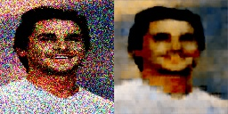
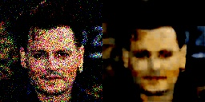
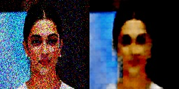
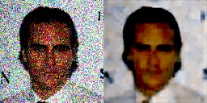

# Denoising color image using autoencoder.

## Description:
    - A autoencoder made of CNN (encoder) and transpose CNN (decoder) to 
    denoise 3-channel image.
    - Dataset used: CelebA.
    - Trained model is saved in .pth file and used to denoise test images.
    
## Output Images:

## Training and Predicting:
    - Use denoise.ipynb to train model.
    - use saved .pth file to get denoised output using main.py file.

